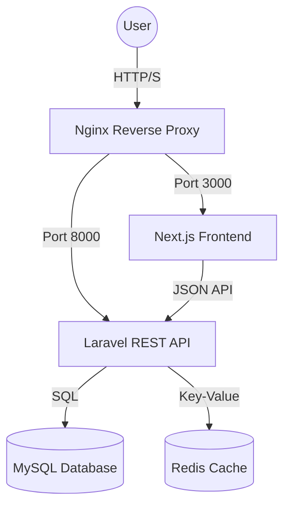

# Column 📰 - Modern Blog Platform

<div align="center">
  
  
  
  
  
  
</div>

---

### 🌟 Overview

**Column** is a high-performance, full-featured blogging platform built for the modern web. It features a scalable **Laravel 11** backend API and a stunning **Next.js 16** frontend, all orchestrated with **Docker** for a seamless developer experience.

> This project is designed to be production-ready out of the box with built-in patterns for authentication, caching, and SEO.

---

### 🚀 Quick Start (Recommended)

Get the entire system running in minutes with a single command:

```bash
# Clone the repository
git clone git@github.com:nishan-paul-2022/column-simple-blogging-site.git
cd column-simple-blogging-site

# Run the automated installer
bash install.sh
```

**What happens?** 
- 🐳 Builds Docker images and starts all services (MySQL, Redis, API, Frontend, Nginx).
- 🔑 Sets up `.env` files and generates app keys.
- 🏗️ Runs database migrations and seeds the DB with rich sample data.
- ⚡ Optimizes caches for performance.

**URLs:**
- **Frontend**: [http://localhost:3000](http://localhost:3000)
- **API**: [http://localhost:8000/api](http://localhost:8000/api)
- **Nginx Entry**: [http://localhost](http://localhost)

**Admin Credentials:**
- 📧 **Email:** `admin@blog.test`
- 🔑 **Password:** `password`

---

### 🏗️ System Architecture



---

### 🛠️ Tech Stack

#### 🔙 Backend (Laravel 11)
- **PHP 8.2+** - Core language.
- **Sanctum** - Secure token-based authentication.
- **Eloquent ORM** - Elegant database modeling.
- **Pint & PHPStan** - Linting and static analysis.

#### 🔜 Frontend (Next.js 16)
- **React 18** - Component-based UI.
- **TypeScript** - Type safety throughout.
- **Tailwind CSS** - Modern utility-first styling.
- **Framer Motion** - Liquid smooth animations.

#### 📦 Infrastructure
- **Docker & Compose** - Containerization & orchestration.
- **Nginx** - High-performance reverse proxy.
- **Redis** - Lightning-fast caching layer.

---

### 📂 Project Structure

```text
├── app-backend/        # Laravel 11 REST API
├── app-frontend/       # Next.js 16 Application
├── docker/             # Dockerfiles & Configurations
├── nginx.conf          # Reverse proxy configuration
├── Makefile            # Useful development shortcuts
└── install.sh          # All-in-one setup script
```

---

### 🔧 Development Commands

Manage your project efficiently using the provided `Makefile`:

| Command | Description |
| :--- | :--- |
| `make start` | Start all services in the background |
| `make stop` | Stop all services |
| `make status` | Check service health |
| `make logs` | Stream logs from all containers |
| `make lint` | Run frontend & backend linters |
| `make format` | Auto-format frontend & backend code |
| `make rebuild` | Wipe containers and rebuild from scratch |

---

### 🔌 API Highlights

The backend provides a comprehensive REST interface:

- `GET /api/posts` - Fetch all published posts (with search/filter).
- `GET /api/posts/{slug}` - Details for a single post.
- `POST /api/auth/login` - Secure user authentication.
- `POST /api/posts/{id}/comments` - Authorize-only commenting.

---

### 🛡️ Security Features
- **CSRF Protection** via Laravel Sanctum.
- **Rate Limiting** on API endpoints.
- **Input Validation** using Form Requests.
- **Role-based Access Control (RBAC)** for admin actions.

---

<div align="center">
  
  <p>Built with ❤️ by <b><a href="https://kaiofficial.xyz/">KAI</a></b></p>
</div>
